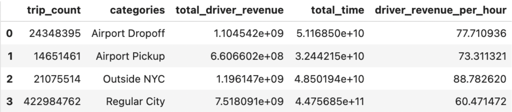

# Should NYC Rideshare Drivers Accept Airport Dropoff Trips? A Regression and Simulation Analysis

### Overview 

Rideshare drivers widely regard airport dropoffs as lucrative due to longer distances and higher base fares, but the return trip uncertainty introduces real risk. After dropping off at an airport, a driver must either join the virtual queue and wait for a return trip or deadhead back to the city empty, losing both time and potential earnings. The true cost of an airport trip is therefore not just the fare but the opportunity cost of time spent waiting instead of completing city trips.

Using 1.9 million NYC TLC High Volume FHV trips from 2024 to 2025, a regression model and Monte Carlo simulation were built to quantify whether accepting an airport trip during a 3-hour shift is more profitable than staying in the city. Results suggest the airport premium is real but time sensitive, varying meaningfully by borough and hour of day.

### Data
- Source:  NYC TLC Trip Record Data, High Volume FHV (2024 - 2025)
- Size: 1.9 million observations
- **Key Variables**: (PULocationID, DOLocationID, pickup_datetime, borough, trip_duration, driver_pay)
- To keep trips representative of typical city travel, the sample was restricted to trips under two hours.

### Methodology
Based on the aggregation, airport drop-offs show meaningfully higher average earnings than non-airport trips. 

This however, is confounded by trip length, time of day, and borough of origin, all of which independently influence driver earnings. In order to isolate these variables a linear regression of **log(driver_pay) ~ is_JFK + is_LGA + is_EWR + C(hour) + C(borough) + log(trip_duration)** was applied. 

