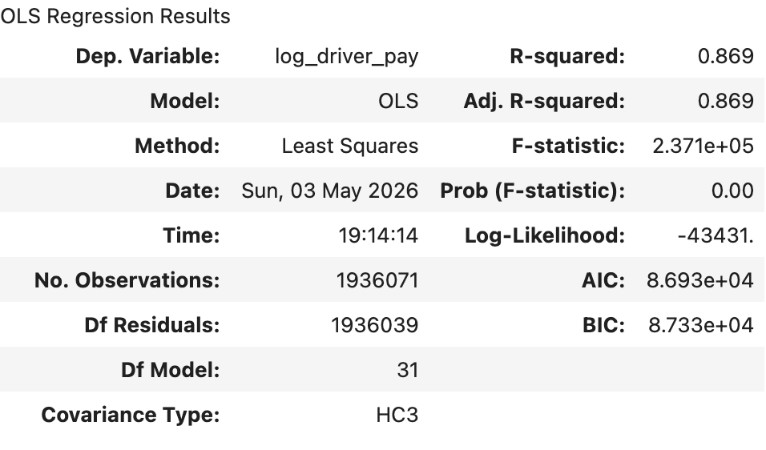
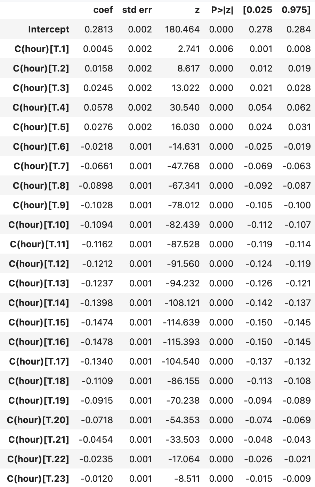
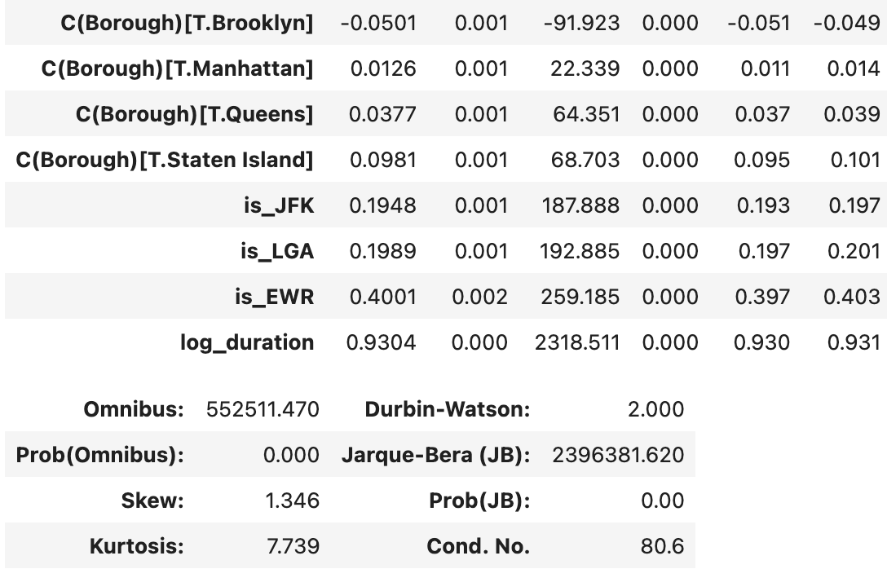
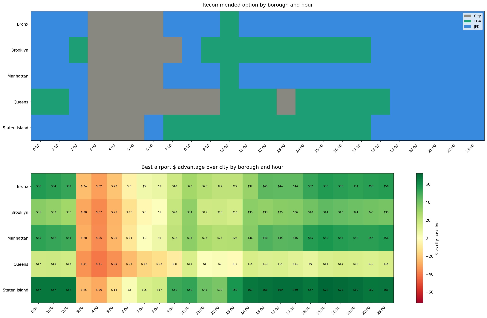

# Should NYC Rideshare Drivers Accept Airport Dropoff Trips? A Regression and Simulation Analysis

### Overview 

Rideshare drivers widely regard airport dropoffs as lucrative due to longer distances and higher base fares, but the return trip uncertainty introduces real risk. After dropping off at an airport, a driver must either join the virtual queue and wait for a return trip or deadhead back to the city empty, losing both time and potential earnings. The true cost of an airport trip is therefore not just the fare but the opportunity cost of time spent waiting instead of completing city trips.

Using 1.9 million NYC TLC High Volume FHV trips from 2024 to 2025, a regression model and Monte Carlo simulation were built to quantify whether accepting an airport trip during a 3-hour shift is more profitable than staying in the city. Results suggest the airport premium is real but time sensitive, varying meaningfully by borough and hour of day.

### Data
- Source:  NYC TLC Trip Record Data, High Volume FHV (2024 - 2025)
- Size: 1.9 million observations
- **Key Variables**: (PULocationID, DOLocationID, pickup_datetime, borough, trip_duration, driver_pay)
- To keep trips representative of typical city travel, the sample was restricted to trips under two hours.

### Methodology

#### Linear Regression

Based on the aggregation, airport drop-offs show meaningfully higher average earnings than non-airport trips. 

This however, is confounded by trip length, time of day, and borough of origin, all of which independently influence driver earnings. In order to isolate these variables a linear regression of **log(driver_pay) ~ is_JFK + is_LGA + is_EWR + C(hour) + C(borough) + log(trip_duration)** was applied. Linear regression is appropriate here because driver pay is a continuous outcome and trip duration exhibits a roughly linear relationship with earnings. Log transformations were applied in an attempt to make errors of constant variance.

The model explains roughly 87% of the variation in log driver pay, and all three airport indicators are positive, large, and statistically significant. Holding trip duration, hour, and borough constant, we interpret the airport coefficients using the formula $(e^{b} - 1) \times 100$ which gives the true percentage change in driver pay associated with each airport relative to a comparable non-airport trip. A JFK dropoff is associated with a 21.5% pay premium, LGA with 22.0%, and EWR with 49.2%. The log duration coefficient of 0.93 confirms that pay grows nearly proportionally with trip length. Hour and borough fixed effects behave as expected, with late night hours and Staten Island pickups commanding the highest premiums, and midday hours and Brooklyn pickups the lowest.

The normality assumption is violated, indicating a heavy right tail even after transformation. However, with 1.9 million observations and HC3 robust standard errors, coefficient estimates remain consistent and inference remains valid.

#### Simulation

The simulation models a three-hour shift and compares total expected earnings across three paths: staying in the city, taking a JFK dropoff, or taking an LGA dropoff. For each borough and hour combination, 10,000 shifts were simulated and the path with the highest mean earnings was recommended.

**Key Assumptions**
- Drivers always join the airport queue after dropoff with no immediate deadhead
- Return trip probability is proxied by the hourly pickup to dropoff ratio at each airport, capped at 1
- Wait time follows a log-normal distribution parameterized by the pickup to dropoff ratio
- Fare and trip duration inputs are averaged by borough and hour from the raw data

The city baseline applies the average local earnings rate over 180 minutes at 58% utilization. Airport paths accumulate earnings across three stages (outbound fare, wait time, and return trip), each drawn from distributions parameterized by the borough-airport-hour averages. If no return trip is secured, the driver deadheads back. Remaining time on each path is filled with local trips at borough-hour average rates, and the recommended path is the one with the highest mean earnings.

#### Results

JFK dominates recommendations across most boroughs and hours, particularly from 7pm to 2am, while LGA is competitive through the mid-day window, most clearly in Brooklyn and Staten Island, where LGA holds the recommendation almost continuously from around 7am to 6pm. Queens breaks this pattern, since rather than favoring an airport all day, it reverts to the city baseline during the late-morning to early-afternoon stretch (roughly 8:30am to 1:30pm), and even outside that window its airport advantage in dollar terms is consistently among the smallest of the five boroughs, often just $1 to $20, compared to $30 to $50+ elsewhere. The city baseline is otherwise only preferred during the overnight and early morning hours (roughly 3:00 to 6:00), when return trip probability is low and the wait cost outweighs the fare premium. Staten Island shows the highest airport premium in terms of pay, consistent with its far distance from the airports. Queens, by contrast, shows the weakest airport advantage overall, likely because drivers are already close to both airports and face a higher opportunity cost of leaving; the marginal benefit of detouring to an airport pickup is small when you're already near one. Overall, the airport premium is real but time sensitive, with the size of the benefit depending heavily on the borough's baseline proximity to JFK and LGA.

